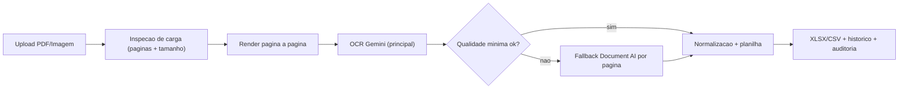

# Leitor Seguro OCR

Pipeline OCR para listas de presenca com foco em velocidade, qualidade de extracao e operacao em escala via dashboard web.

**Demo ao vivo:** https://leitor-ocr.fly.dev

## Visao Geral

Este projeto processa PDFs e imagens de listas de presenca e gera planilhas estruturadas (`XLSX` ou `CSV`) com rastreabilidade de execucao.

Principais objetivos:
- processamento rapido para alto volume de documentos;
- melhor leitura de campos manuscritos sem perder consistencia estrutural;
- fallback seletivo para aumentar confiabilidade;
- operacao simples para equipes nao tecnicas.

## Destaques Tecnicos

- Pipeline hibrido: Gemini como caminho principal + Document AI como fallback por pagina.
- Processamento pagina a pagina com perfil dinamico por tamanho do arquivo e quantidade de paginas.
- Dashboard com upload, historico, download e limpeza de historico.
- Logs de tempo por etapa para auditoria de performance.
- Suporte a execucao local e Cloud Run.

## Arquitetura (resumo)



## Stack

- Python 3.11+
- OCR/IA: Gemini + Document AI
- Backend Web: `http.server` customizado
- Armazenamento:
- Local: SQLite + filesystem
- Cloud: Firestore + Google Cloud Storage
- Deploy: Docker + Cloud Run

## Estrutura do Projeto

```text
leitor_OCR/
  web_app.py                  # servidor web e rotas
  attendance_pipeline.py      # orquestrador do pipeline hibrido
  gemini_extractor.py         # extracao via Gemini por pagina
  documentai_extractor.py     # fallback com Document AI
  extrator_ocr.py             # renderizacao e utilitarios OCR
  assinatura_lista.py         # regras de pos-processamento das listas
  static/                     # frontend (dashboard)
  tests/                      # testes automatizados
  requirements.txt            # dependencias Python
```

## Como Rodar Localmente

1. Criar ambiente virtual:
```bash
python -m venv .venv
```

2. Ativar ambiente:
```bash
# Windows (PowerShell)
.venv\Scripts\Activate.ps1
```

3. Instalar dependencias:
```bash
pip install -r requirements.txt
```

4. Configurar variaveis de ambiente:
```bash
copy .env.example .env
```

5. Iniciar o app:
```bash
python web_app.py
```

6. Acessar no navegador:
```text
http://127.0.0.1:8000
```

## Deploy em Producao (Cloud Run)

Deploy rapido:
```bash
gcloud run deploy leitor-ocr --source . --region southamerica-east1 --project listreader
```

Scripts utilitarios:
- `deploy_manual.ps1` (fonte local para Cloud Run)
- `deploy.ps1` (Cloud Build + deploy)
- `deploy_with_auth.ps1` (build/push de imagem + deploy)
- `verify_prod_readiness.ps1` (check de prontidao)

## Configuracoes Importantes

Exemplos de variaveis relevantes:
- `OCR_USE_GEMINI=true`
- `OCR_USE_DOCUMENTAI=true`
- `OCR_GEMINI_MAX_CONCURRENCY=4`
- `OCR_GEMINI_STABLE_MAX_CONCURRENCY=4`
- `OCR_GEMINI_SMALL_DPI=180`
- `OCR_GEMINI_MEDIUM_DPI=160`
- `OCR_GEMINI_LARGE_DPI=140`
- `OCR_TIMING_LOGS=true`
- `OCR_STORAGE_MODE=cloud`
- `OCR_GCS_BUCKET=<bucket>`

## Qualidade e Testes

Rodar testes:
```bash
python -m unittest discover -s tests -q
```

## Fluxo Operacional

- Upload de PDF/JPG/PNG ate 25MB.
- Selecao de formato de saida (`XLSX` recomendado).
- Processamento assicrono com atualizacao automatica no painel.
- Download do resultado e auditoria dos eventos.

## Documentacao Complementar

- [ARQUITETURA.md](./ARQUITETURA.md)
- [DEPLOY.md](./DEPLOY.md)
- [DEPLOY_CLOUD.md](./DEPLOY_CLOUD.md)
- [DOCUMENTAI_SETUP.md](./DOCUMENTAI_SETUP.md)
- [CHECKLIST_ACEITE_PRODUCAO.md](./CHECKLIST_ACEITE_PRODUCAO.md)
- [CHANGES.md](./CHANGES.md)

## Observacoes

- O modo de acesso da interface pode ser ajustado para login obrigatorio por usuario.
- Em ambiente cloud, mantenha credenciais e segredos fora do repositorio.
- Para volumes altos, priorize monitoramento de latencia por pagina e revisao periodica dos perfis de processamento.
