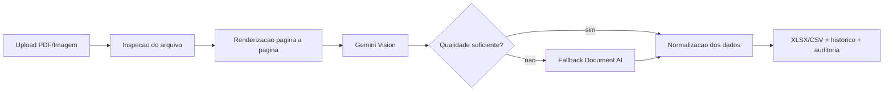

# Leitor Seguro OCR

Aplicacao web para leitura e extracao estruturada de listas de presenca em PDF ou imagem, com saida em XLSX ou CSV e foco em automacao operacional.

[](https://leitor-ocr.fly.dev/)
[](#stack)
[](#arquitetura-resumida)
[](#visao-geral)

## Visao Geral

O Leitor Seguro OCR foi criado para reduzir o trabalho manual de leitura de listas de presenca e transformar documentos em dados prontos para operacao. O sistema processa arquivos em PDF ou imagem, identifica presenca, rubricas e manuscritos e devolve o resultado em planilha estruturada.

O projeto foi pensado para cenarios reais de uso, com foco em:

- velocidade de processamento;
- melhor leitura de campos manuscritos;
- confiabilidade com fallback por pagina;
- rastreabilidade da execucao;
- entrega final pronta para conferencia em Excel.

## O que o sistema faz

- recebe PDF, JPG, JPEG e PNG;
- renderiza paginas e escolhe perfil de processamento;
- usa Gemini como leitura principal;
- usa Document AI como fallback quando necessario;
- classifica presenca, rubrica, nome manuscrito e marcacoes;
- gera XLSX ou CSV com estrutura pronta para uso;
- registra historico, auditoria e estado dos jobs no painel.

## Arquitetura resumida



## Stack

### Backend e processamento

- Python 3.11+
- servidor web customizado com `http.server`
- pipeline OCR por pagina
- SQLite e filesystem no modo local
- Firestore e Google Cloud Storage no modo cloud

### OCR e documentos

- Gemini
- Google Document AI
- PyMuPDF
- Pillow
- openpyxl
- rapidocr-onnxruntime

### Deploy

- Docker
- Fly.io
- Cloud Run

## Estrutura principal

```text
leitor_OCR/
  web_app.py                # servidor web e rotas
  attendance_pipeline.py    # orquestracao do pipeline hibrido
  gemini_extractor.py       # extracao via Gemini
  documentai_extractor.py   # fallback com Document AI
  extrator_ocr.py           # renderizacao e utilitarios OCR
  postprocess_manuscrito.py # tratamento de texto manuscrito
  static/                   # dashboard web
  tests/                    # testes automatizados
  docs/                     # arquitetura e deploy
```

## Como rodar localmente

### Pre-requisitos

- Python 3.11+

### Instalacao

```bash
python -m venv .venv
```

```bash
# PowerShell
.venv\Scripts\Activate.ps1
pip install -r requirements.txt
copy .env.example .env
python web_app.py
```

Depois disso, acesse:

```text
http://127.0.0.1:8000
```

## Variaveis importantes

```env
OCR_USE_GEMINI=true
OCR_USE_DOCUMENTAI=true
OCR_STORAGE_MODE=cloud
OCR_GCS_BUCKET=
OCR_GEMINI_MAX_CONCURRENCY=4
OCR_TIMING_LOGS=true
```

## Testes

```bash
python -m unittest discover -s tests -q
```

## Fluxo operacional

1. Upload do arquivo
2. Analise de paginas e tamanho
3. OCR principal
4. Fallback seletivo
5. Normalizacao dos dados
6. Geração da planilha
7. Download e consulta do historico

## Objetivo do projeto

Este projeto faz parte do meu portfolio como exemplo de automacao aplicada a documentos e OCR em contexto operacional. Ele foi desenvolvido para mostrar:

- aplicacao pratica de IA em processo de negocio;
- pipeline de extracao com tolerancia a variacao de entrada;
- organizacao de dados para uso real;
- preocupacao com auditabilidade, historico e saida operacional.

## Demo

- Aplicacao online: https://leitor-ocr.fly.dev/

## Repositorio

- Codigo: https://github.com/Cesare221/Leitor_OCR

## Documentacao complementar

- [Arquitetura](./docs/ARQUITETURA.md)
- [Deploy Fly.io](./docs/DEPLOY_FLY.md)
- [Deploy Cloud Run](./docs/DEPLOY_CLOUD.md)
- [Document AI Setup](./docs/DOCUMENTAI_SETUP.md)

## Contato

- Portfolio: https://cesarddev.com.br/
- GitHub: https://github.com/Cesare221
- LinkedIn: https://linkedin.com/in/cdelmondes

Se este projeto fizer sentido para o seu contexto, fico a disposicao para conversar sobre OCR, automacao de documentos e estruturacao de pipelines de extracao.
